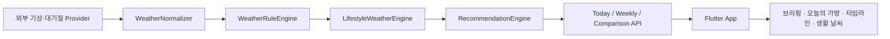

# 날씨챙겨

날씨챙겨는 날씨 수치를 나열하기보다, 사용자가 오늘 무엇을 챙기고 어떻게 행동하면 좋은지를 먼저 안내하는 생활형 날씨 서비스입니다.

## 프로젝트 구성

- `weather_care_app`: Flutter 모바일 앱
- `weather_care_server`: Cloudflare Workers + TypeScript + Hono + D1 서버
- `docs`: 앱/서버 개발명세서

## 앱과 서버의 역할 구분

핵심 원칙은 **날씨 조건과 추천 여부는 서버가 판단하고, 앱은 서버 결과를 사용자에게 표시한다**는 것입니다. 앱은 기온, 강수확률, 미세먼지 등의 수치를 이용해 Recommendation Threshold를 다시 계산하지 않습니다.

| 영역 | 앱 (`weather_care_app`) | 서버 (`weather_care_server`) |
| --- | --- | --- |
| 날씨 데이터 | 서버의 Today/Weekly/Comparison API를 호출하고 응답을 화면에 표시 | 외부 기상·대기질·과거 날씨 Provider를 호출하고 공통 모델로 정규화 |
| 날씨 판단 | 서버가 내려준 상태와 설명을 신뢰하고 표시 | `WeatherRuleEngine`에서 강수, 강설, 자외선, 더위, 추위, 대기질 등의 객관적 상태를 판단 |
| 생활 해석 | LifestyleMessage를 생활 날씨 UI로 표시 | `LifestyleWeatherEngine`에서 RuleFact를 생활 관점의 LifestyleInsight로 변환 |
| 준비물 추천 | Recommendation을 우선순위대로 표시하고 아이콘·색상·딥링크를 매핑 | `RecommendationEngine`에서 우산, 양산, 겉옷, 마스크, 물, 선크림, 폭설 주의를 생성하고 중복·우선순위·사용자 설정을 적용 |
| 위치 | GPS 권한 처리, MANUAL 지역 선택, 좌표를 `nx/ny` Grid로 변환 | 정확한 GPS 좌표 대신 `nx/ny`, Region, Installation, Topic 정보를 저장 |
| 설정 | 알림 시간과 항목별 ON/OFF UI, 로컬 설정 상태 관리 | Installation별 알림 설정을 D1에 저장하고 Push 생성 시 적용 |
| Push | FCM 토큰 등록·갱신, 알림 수신, 딥링크 이동 | Cron 스케줄링, Morning Brief 구성, 중복 방지, FCM HTTP v1 전송 |
| UI 상태 | `챙겼어요` 같은 하루 단위 체크 상태를 로컬에서 관리 | 필수 저장 대상이 아니며 관여하지 않음 |
| Theme | 날씨 상태를 Soft Weather 색상으로 표현하되 추천 여부는 판단하지 않음 | 정규화된 날씨 상태와 Recommendation/Lifestyle 데이터를 제공 |

## 데이터 흐름



## 서버가 없어도 앱이 동작하는 이유

현재 앱에는 UI 개발과 에뮬레이터 검증을 위한 샘플 응답이 포함되어 있습니다.

1. 앱 시작 시 `lib/data/sample_payloads.dart`의 Today/Weekly 샘플을 즉시 표시합니다.
2. 동시에 서버의 Today/Weekly API에 연결을 시도합니다.
3. 서버 응답이 성공하면 화면 데이터를 서버 응답으로 교체합니다.
4. 연결 실패, Timeout, 비정상 응답이 발생하면 샘플 데이터를 계속 사용합니다.

홈 상단 데이터 출처 배지는 현재 상태를 다음과 같이 표시합니다.

- `서버 확인 중`: 서버 연결을 시도하는 중
- `실시간 서버`: 서버 응답을 사용 중
- `샘플 데이터`: 앱 내장 샘플 응답을 사용 중

샘플 데이터에는 이미 계산된 Recommendation, LifestyleMessage, Timeline이 들어 있습니다. 앱이 샘플 날씨 수치로 추천 기준을 직접 계산하는 것은 아닙니다.

## 현재 구현 상태

### 앱

- Final Home 및 Soft Weather UI 구현
- Today/Weekly API 클라이언트와 샘플 Fallback 구현
- Recommendation 표시, 로컬 `챙겼어요` 상태, 상세 화면 이동 구현
- GPS/MANUAL 및 알림 설정 UI 구현
- 실제 GPS 권한·좌표 변환·설정 영구 저장은 미구현
- FCM 토큰 등록·수신·딥링크 처리는 미구현
- 설정 변경의 서버 동기화는 미구현이며 현재 메모리에서만 유지

### 서버

- Today/Weekly/Comparison 및 Installation/Notification Settings 라우트 골격 구현
- Rule/Lifestyle/Recommendation Engine 모듈 구현
- D1 Repository와 Migration 초안 구현
- Weather/Air/Historical Provider는 현재 Dummy 구현
- Weekly API 응답은 현재 일부 날짜가 하드코딩된 골격
- Recommendation 알림 조회는 Placeholder로 빈 배열을 반환
- FCM 전송 함수는 TODO 상태이며 실제 Push를 발송하지 않음

따라서 현재 서버를 실행하더라도 실제 기상 API 기반 서비스가 아니라 더미 Provider 기반 응답을 반환합니다.

## 서버 연결

앱은 별도 실행 인자 없이 다음 Cloudflare 운영 서버를 기본으로 사용합니다.

```text
https://weather-care-server.sy40222.workers.dev
```

로컬 Workers 서버를 사용할 때 Android 에뮬레이터에서는 호스트 PC의 `localhost`가
아니라 `10.0.2.2`로 접근해야 합니다.

기본 운영 서버 대신 로컬 서버를 사용할 때만 `SERVER_URL`을 지정합니다.

```bash
cd weather_care_app
flutter run -d emulator-5554 --dart-define=SERVER_URL=http://10.0.2.2:8787
```

각 프로젝트의 실행 방법과 API 목록은 다음 문서를 참고합니다.

- [Flutter 앱 README](weather_care_app/README.md)
- [서버 README](weather_care_server/README.md)
