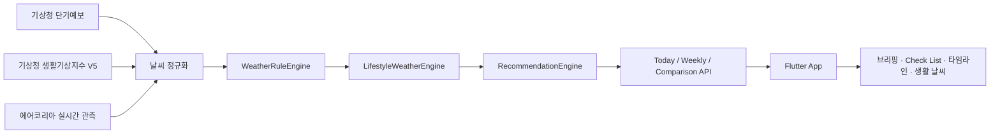

# 날씨챙겨

날씨챙겨는 날씨 수치를 나열하기보다, 사용자가 오늘 무엇을 챙기고 어떻게 행동하면 좋은지를 먼저 안내하는 생활형 날씨 서비스입니다.

## 프로젝트 구성

- `weather_care_app`: Flutter 모바일 앱
- `weather_care_server`: Cloudflare Workers + TypeScript + Hono + D1 서버
- `docs`: 앱/서버 개발명세서

## 앱과 서버의 역할 구분

핵심 원칙은 **날씨 조건과 추천 여부는 서버가 판단하고, 앱은 서버 결과를 사용자에게 표시한다**는 것입니다. 앱은 기온, 강수확률, 미세먼지 등의 수치를 이용해 Recommendation Threshold를 다시 계산하지 않습니다.

| 영역 | 앱 (`weather_care_app`) | 서버 (`weather_care_server`) |
| --- | --- | --- |
| 날씨 데이터 | 서버를 우선 호출하고, 서버 장애 시 기상청 단기예보 원시 데이터와 공식 산식 체감온도를 직접 조회 | 기상청 단기예보·생활기상지수 V5와 에어코리아 관측값을 공통 모델로 정규화·병합하고 기상청 계절별 산식으로 체감온도를 계산 |
| 날씨 판단 | 서버가 내려준 상태와 설명을 신뢰하고 표시 | `WeatherRuleEngine`에서 강수, 강설, 자외선, 더위, 추위, 대기질 등의 객관적 상태를 판단 |
| 생활 해석 | LifestyleMessage를 생활 날씨 UI로 표시 | `LifestyleWeatherEngine`에서 RuleFact를 생활 관점의 LifestyleInsight로 변환 |
| 준비물 추천 | Recommendation을 우선순위대로 표시하고 아이콘·색상·딥링크를 매핑 | `RecommendationEngine`에서 우산, 양산, 겉옷, 마스크, 물, 선크림, 폭설 주의를 생성하고 중복·우선순위·사용자 설정을 적용 |
| 위치 | GPS 권한 처리, MANUAL 지역 선택, 좌표를 `nx/ny` Grid로 변환 | 정확한 GPS 좌표 대신 `nx/ny`, Region, Installation, Topic 정보를 저장 |
| 설정 | 알림 시간과 항목별 ON/OFF UI, 로컬 설정 상태 관리 | Installation별 알림 설정을 D1에 저장하고 Push 생성 시 적용 |
| Push | FCM 토큰 등록·갱신, 알림 수신, 딥링크 이동 | Cron 스케줄링, Morning Brief 구성, 중복 방지, FCM HTTP v1 전송 |
| UI 상태 | `챙겼어요` 같은 하루 단위 체크 상태를 로컬에서 관리 | 필수 저장 대상이 아니며 관여하지 않음 |
| Theme | 날씨 상태를 Soft Weather 색상으로 표현하되 추천 여부는 판단하지 않음 | 정규화된 날씨 상태와 Recommendation/Lifestyle 데이터를 제공 |

## 데이터 흐름



## 서버 장애 및 오프라인 동작

앱 화면에서는 내장 고정 응답을 사용하지 않습니다.

1. 앱이 운영 서버의 Today/Weekly API를 먼저 호출합니다.
2. 서버 연결에 실패하고 인터넷은 연결되어 있으면 앱이 기상청 단기예보를 직접 조회합니다.
3. 직접 조회에서는 기온·습도·바람·강수·하늘 상태, 기상청 공식 산식 체감온도와 시간별·일별 예보를 표시합니다.
4. 추천, 생활 날씨, 준비물, 타임라인처럼 서버 판단이 필요한 항목은 `운영 서버 미연결로 미지원`으로 표시합니다.
5. 인터넷 연결도 없으면 날씨 화면 전체를 `인터넷 연결 불가로 미지원`으로 표시합니다.

홈 상단 데이터 출처 배지는 현재 상태를 다음과 같이 표시합니다.

- `서버 확인 중`: 서버 연결을 시도하는 중
- `기상청 단기예보`: 운영 서버의 기상청 응답을 사용 중
- `기상청 직접 조회`: 운영 서버 장애로 앱이 기상청 원시 예보를 사용 중

## 현재 구현 상태

### 앱

- Final Home 및 Soft Weather UI 구현
- Today/Weekly API 클라이언트와 기상청 직접 조회 Fallback 구현
- Recommendation 표시, 로컬 `챙겼어요` 상태, 상세 화면 이동 구현
- GPS/MANUAL 및 알림 설정 UI 구현
- 실제 GPS 권한·좌표 변환·설정 영구 저장은 미구현
- 기기별 설치 ID와 FCM 토큰 등록·갱신, 백그라운드 알림 수신 구현
- 알림 선택 시 상세 화면으로 이동하는 딥링크 처리는 미구현
- 설정 변경의 서버 동기화는 미구현이며 현재 메모리에서만 유지

### 서버

- Today/Weekly/Comparison 및 Installation/Notification Settings 라우트 골격 구현
- Rule/Lifestyle/Recommendation Engine 모듈 구현
- D1 Repository와 Migration 초안 구현
- Weather Provider는 공공데이터포털의 기상청 단기예보 API와 연결
- 자외선은 기상청 생활기상지수 V5의 3시간 예측, PM10·PM2.5·오존은 에어코리아 실시간 관측값을 사용
- 체감온도는 서버와 앱 직접조회 모두 기상청의 여름·겨울 계절별 산식을 사용하며 Main 문구는 한국인 PT 연구와 기상청 위험값을 조합
- 환경 Provider는 D1 캐시, 제한된 stale-if-error, 개별 가용 상태를 제공하며 장애가 기온·강수 API 전체를 실패시키지 않음
- Weekly API는 기상청 단기예보가 제공하는 오늘부터 글피까지 반환
- Cron이 지역별 예보에서 Recommendation을 생성하고 사용자 설정·당일 전송 이력을
  확인해 FCM HTTP v1 알림을 전송
- FCM 서비스 계정 Secret이 운영 Worker에 등록되어야 실제 Push가 발송됨

서버의 공공데이터포털 일반 인증키는 로컬 `.dev.vars` 또는 운영 Worker Secret의 `KMA_SERVICE_KEY`로 주입합니다. 같은 키를 사용하더라도 공공데이터포털에서 단기예보, 생활기상지수(5.0), 에어코리아 대기오염정보 세 서비스를 각각 활용신청해야 전체 지표가 제공됩니다.
앱 직접 조회용 키는 Git 제외 대상 `config/kma.config.json`에 저장하며 앱 시작 시
불러옵니다. 이 파일은 Debug/Release 바이너리에 포함되어 추출될 수 있으므로 호출량과
키 교체 정책을 별도로 관리해야 합니다.

## 서버 연결

앱은 별도 실행 인자 없이 다음 Cloudflare 운영 서버를 기본으로 사용합니다.

```text
https://weather-care-server.sy40222.workers.dev
```

로컬 Workers 서버를 사용할 때 Android 에뮬레이터에서는 호스트 PC의 `localhost`가
아니라 `10.0.2.2`로 접근해야 합니다.

기본 운영 서버 대신 로컬 서버를 사용할 때만 `SERVER_URL`을 지정합니다.

```bash
cd weather_care_app
flutter run -d emulator-5554 --dart-define=SERVER_URL=http://10.0.2.2:8787
```

운영 서버 장애 시 앱 직접 조회까지 사용하려면
`weather_care_app/config/kma.config.json`에 기상청 일반 인증키를 입력합니다. 앱이
설정 파일을 자산으로 읽으므로 IntelliJ Debug와 Release 빌드에 모두 자동 적용됩니다.

```json
{
  "SERVER_URL": "https://weather-care-server.sy40222.workers.dev",
  "KMA_SERVICE_KEY": "발급받은_일반인증키"
}
```

실제 파일은 Git에서 제외되며 저장소에는 `config/kma.config.example.json`만
포함됩니다.

각 프로젝트의 실행 방법과 API 목록은 다음 문서를 참고합니다.

- [Flutter 앱 README](weather_care_app/README.md)
- [서버 README](weather_care_server/README.md)
